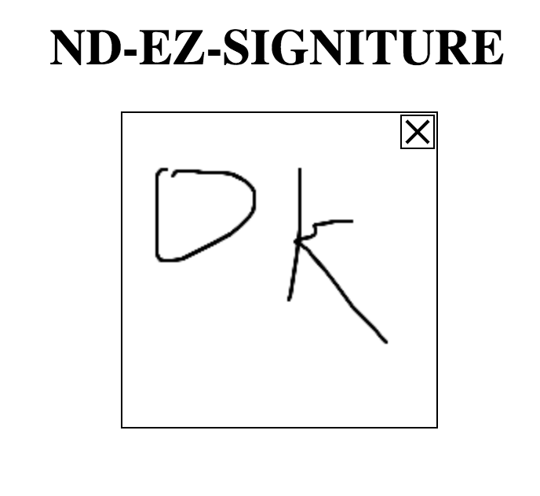

# NdEzSigniture

## What is it ? 

Easy to use ANGULAR component: electronic signiture that will give you base64 image data

 


## Installation
``` npm i nd-ez-signiture ```

## Usage

1. Add NdEzSignitureModule import to your @NgModule like example below

``` javascript 
import { BrowserModule } from '@angular/platform-browser';
import { NgModule } from '@angular/core';

import { AppComponent } from './app.component';
import { NdEzSignitureModule } from './modules/nd-ez-signiture/nd-ez-signiture.module';

@NgModule({
  declarations: [
    AppComponent
  ],
  imports: [
    BrowserModule,
    NdEzSignitureModule
  ],
  providers: [],
  bootstrap: [AppComponent]
})
export class AppModule {
 
 }
```
2. In your template 
```HTML 
<nd-ez-signiture (dataSigniture)='handleData($event)'></nd-ez-signiture> 
 ```
 3. dataSigniture event will be fired every time canvas changes and it outputs 2 parametars

 ```javascript 
import { Component } from '@angular/core';

@Component({
  selector: 'app-root',
  templateUrl: './app.component.html',
  styleUrls: ['./app.component.css']
})
export class AppComponent {
  handleData(ev){
    console.log(ev)
  }
}


 ```
 will outout 

 ```javascript 
 {
    image: null,
    isEmptyCanvas: true
 }

 ```
 4. Options you can change

 ```HTML 
<nd-ez-signiture [width]='200' [height]='200'  ndStrokeColor='#000'  [ndLineWidth]='2' (dataSigniture)='handleData($event)' ></nd-ez-signiture> 

```
 * width - width of canvas - default 200
 * height - height of canvas - default 200
 * ndStrokeColor - the color of the brush/stroke - default black
 * ndLineWidth - how fat you want the line to be - default 3

